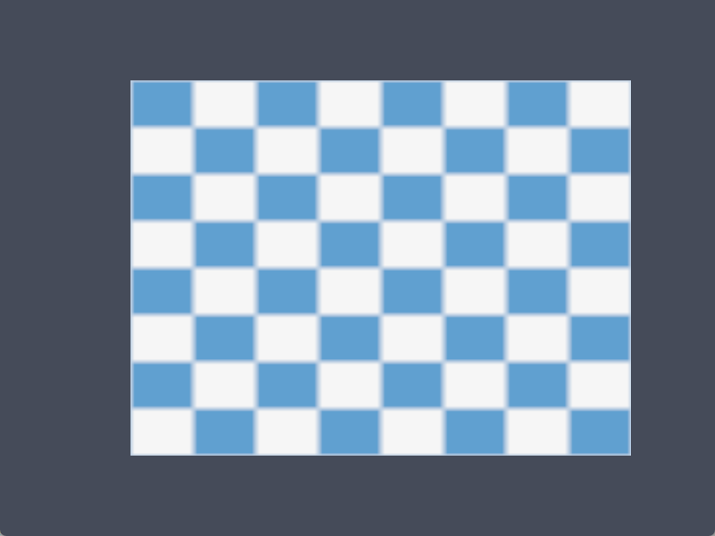
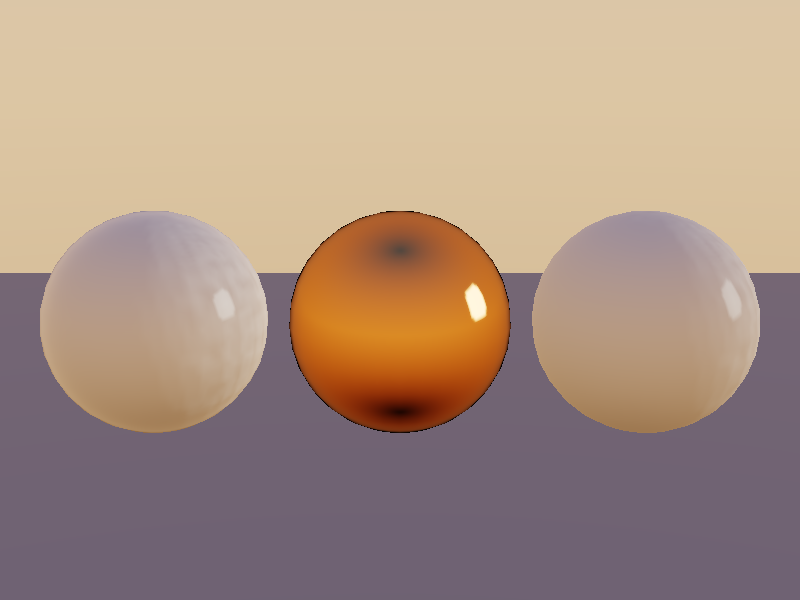
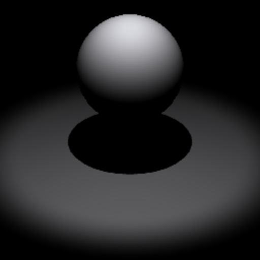
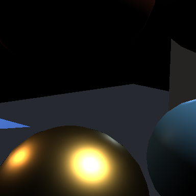
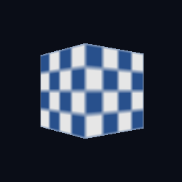

# LumaC

Lightweight cross-platform graphics API written in C11, with native Windows/Linux windowing and a Vulkan backend.

[](https://en.cppreference.com/w/c/11)
[](LICENSE)



## Overview

LumaC is an experimental pre-1.0 cross-platform graphics API for C
focused on providing a compact foundation for modern rendering
systems. It hides backend complexity (window-system integration,
device selection, swapchain negotiation, frame synchronization,
resource management) behind a handful of opaque handles — `lc_window`,
`lc_device`, `lc_surface`, `lc_swapchain`, `lc_render_target`,
`lc_command_encoder`, `lc_shader`, `lc_pipeline`, `lc_buffer`,
`lc_image`, `lc_sampler` — while staying close to the
underlying API semantics. There is no engine, no scene graph, and no
hidden global state beyond a small explicit tracking registry used
for safe teardown ordering.

The current Vulkan backend can open a window, select a GPU, build a
swapchain with depth, render 3D scenes into offscreen textures and
composite them to the screen in a second pass, and manage buffers and
textured images with mipmaps — all with validation layers clean. A
swapchain is a presentation mechanism, not the universal render
target: pipelines are compatible structurally (formats + samples),
and one frame may contain multiple render passes. On top sits Luma
Renderer (`lr_*`): reusable GPU meshes and unlit materials, cameras,
frustum-culled draw lists, and statistics — with no manual draw
commands in application code. There is no PBR, lighting, or scene
graph yet — those build on this foundation.

## Features

- C11 core with no C++ requirement (headers stay C++-compatible)
- Native Win32 windowing (no SDL/GLFW); X11 backend implemented
- Vulkan device foundation: instance, validation layers, deterministic
  GPU selection, per-family graphics queues
- Vulkan surfaces with present-queue discovery
- Swapchains with capability-driven format/mode/extent selection,
  per-image views, owned depth buffer, transactional recreation, and
  a borrowed render-target view of the same attachments
- Frame lifecycle: acquire, record (one or more passes through a
  borrowed command encoder), submit, present, with two frames in
  flight and recoverable out-of-date/suboptimal handling
- SPIR-V shader modules plus graphics pipelines (vertex input,
  resource slots, raster state, depth test/write, push constants,
  dynamic viewport/scissor, structural render-target signature) over
  cached color+depth render passes; explicit `lc_encoder_*` recording
  or legacy `lc_bind_pipeline` + `lc_draw` convenience
- Render targets: offscreen color (up to 8) + optional depth with
  non-owning views, structural pipeline compatibility (shared across
  equivalent targets), explicit begin/end with backend-neutral
  load/store ops, render-to-texture with sampled second passes
- GPU resource foundation: backend-neutral formats, generic buffers
  (GPU-only / CPU-to-GPU / GPU-to-CPU) with mapping and bounds-checked
  staging writes, backend-neutral vertex layouts (per-vertex and
  per-instance), index buffers (16/32-bit), device limits
- Push constants: small per-draw root data (e.g. MVP matrices) with
  validated ranges and `lc_push_constants`
- Image foundation: 1D/2D/3D images with mips, array layers, and
  cube-compatible structure; default plus explicit subresource views
  (mip/layer ranges, cube, depth aspects); per-subresource layout
  tracking; staging uploads; GPU mipmap generation
- Resource binding: backend-neutral binding layouts/sets, uniform /
  storage / sampled-image / storage-image / sampler slots with
  descriptor arrays, validated updates, device-level descriptor
  allocator, per-frame set binding with canonical signature matching
- Samplers: linear/nearest filtering, mipmap modes, four address
  modes, LOD control, capability-gated anisotropy
- Explicit lifetime model: dependents are destroyed before the objects
  they borrow; shutdown order is pipelines, shaders, samplers, images,
  buffers, swapchains, surfaces, devices, windows
- Static or shared library builds; headless-safe unit tests plus
  Vulkan integration tests that skip cleanly without a GPU/display
- Luma Renderer PBR with direct lights, shadow mapping, and
  image-based lighting: HDR equirect sources become split-sum IBL
  (irradiance + prefilter + BRDF LUT) with a sky pass, HDR scene
  target, and exposure + ACES tonemap output
- Public image readback (tight deterministic rows, mip/layer/depth,
  loud eligibility) with renderer HDR/LDR capture; stable resource
  IDs (no pointer-identity caching); persistent Vulkan pipeline
  cache (seeded/saved through an app path, corrupt-safe, disabled
  mode); internal post-process chain (tint verification stage);
  CPU frame profiling + one-call diagnostics
- AAA memory + synchronization foundation: semantic resource states
  with subresource tracking, explicit transitions, guaranteed
  write→read visibility, block-suballocating GPU memory pools with
  dedicated policy, flush/invalidate mapping, memory stats/budget/
  introspection (10k buffers back onto 1 block)

## Current Status

Early development (`0.1.0-dev`). A two-pass pipeline renders an
indexed, instanced, textured cube with depth testing into an offscreen
target, then samples it to the swapchain; Luma Renderer draws
multi-object culled scenes with shared meshes and materials. There
are no materials beyond unlit, and no PBR, lighting, or compute
systems yet.

| Feature              | Windows          | Linux            |
| -------------------- | ---------------- | ---------------- |
| Core API             | Verified         | Verified         |
| Native windowing     | Win32 verified   | X11 implemented, runtime verified on XWayland |
| Vulkan device        | Verified (RTX 5060) | Runtime verified (lavapipe) |
| Vulkan surface       | Verified         | Runtime verified (XWayland) |
| Swapchain + depth    | Verified         | Runtime verified (lavapipe) |
| Frame presentation   | Verified         | Runtime verified (lavapipe) |
| Triangle rendering   | Verified         | Runtime verified (lavapipe) |
| Shaders / pipeline   | Verified         | Implemented (compiled clean) |
| Buffers / formats    | Verified         | Runtime verified (lavapipe) |
| Images / samplers    | Verified         | Runtime verified (lavapipe) |
| Bindings / textures  | Verified         | Runtime verified (lavapipe) |
| Index / instancing   | Verified         | Implemented (compiled clean) |
| Push constants       | Verified         | Implemented (compiled clean) |
| Depth rendering      | Verified         | Implemented (compiled clean) |
| Render targets (MRT) | Verified         | Implemented (compiled clean) |
| Encoder / 2-pass     | Verified         | Implemented (compiled clean) |
| Readback / capture   | Verified         | Runtime verified (lavapipe, device-only) |
| Pipeline cache       | Verified (file round-trip) | Runtime verified (lavapipe) |
| Sync / transitions   | Verified         | Not exercised (no display) |
| GPU allocator        | Verified (10k→1 block) | Runtime verified (lavapipe, device-only) |
| Validation layers    | Clean            | Not available in test env |
| D3D12                | Planned          | N/A              |
| Wayland              | N/A              | Planned          |

Linux verification comes from WSLg/XWayland with the lavapipe software
driver; native-GPU Linux testing has not been done.

## Quick Start

```bash
cmake -S . -B build
cmake --build build --config Debug
ctest --test-dir build -C Debug --output-on-failure
```

Run the examples — `triangle` (vertex-index generation),
`vertex_triangle` (real GPU vertex buffer), `textured_quad`
(checkerboard texture, animated uniform, mipmapped sampling),
`cube_3d` (indexed textured cube, depth-tested, push-constant MVP,
two instanced copies), `render_to_texture` (cube scene into a
fixed 512x512 offscreen target, sampled fullscreen to the window),
and `renderer_scene` (ground, cubes, sphere through Luma Renderer —
no manual draw commands), `model_viewer` (glTF 2.0 asset through
Luma Assets — `model_viewer [path/to/model.glb]`, defaulting to the
committed `assets/BoxTextured.glb`), `pbr_scene` (metallic x
roughness sphere grid, imported PBR model, normal-mapped wall,
emissive cube, directional + point lights), and `shadow_scene`
(cube + ball under one orbiting shadow-mapped directional light —
`shadow_scene [--frames N]`), and `ibl_scene` (procedural HDR sky
lighting a dielectric/copper sphere trio with no direct lights —
`ibl_scene [--frames N] [--screenshot out.png]`):










```bash
# Windows:
.\build\examples\triangle\Debug\triangle.exe
.\build\examples\vertex_triangle\Debug\vertex_triangle.exe
.\build\examples\textured_quad\Debug\textured_quad.exe
.\build\examples\texture_upload\Debug\texture_upload.exe
.\build\examples\cube_3d\Debug\cube_3d.exe
.\build\examples\render_to_texture\Debug\render_to_texture.exe
.\build\examples\renderer_scene\Debug\renderer_scene.exe
.\build\examples\model_viewer\Debug\model_viewer.exe
.\build\examples\pbr_scene\Debug\pbr_scene.exe
.\build\examples\shadow_scene\Debug\shadow_scene.exe --frames 600
.\build\examples\ibl_scene\Debug\ibl_scene.exe --frames 600
# Linux:
/build/triangle/triangle
/build/vertex_triangle/vertex_triangle
/build/textured_quad/textured_quad
/build/cube_3d/cube_3d
/build/render_to_texture/render_to_texture
/build/renderer_scene/renderer_scene
/build/model_viewer/model_viewer
/build/pbr_scene/pbr_scene
/build/shadow_scene/shadow_scene
/build/ibl_scene/ibl_scene
```

The texture example needs no window: it uploads a checkerboard,
generates mipmaps, and builds an anisotropic sampler, printing each
step.

## Building

Requirements: CMake >= 3.15, a C11 compiler (MSVC, GCC, or Clang),
and Vulkan development files (`find_package(Vulkan REQUIRED)` —
LunarG SDK on Windows, `libvulkan-dev` on Linux). Linux also needs
X11 headers (`libx11-dev`).

### Windows

```bash
cmake -S . -B build
cmake --build build --config Debug
ctest --test-dir build -C Debug --output-on-failure
# Release:
cmake --build build --config Release
```

### Linux

```bash
sudo apt install gcc cmake libvulkan-dev libx11-dev
cmake -S . -B build -DCMAKE_BUILD_TYPE=Release
cmake --build build
ctest --test-dir build --output-on-failure
```

Options:

| Option | Default | Description |
|---|---|---|
| `LUMAC_BUILD_SHARED` | `OFF` | Build as shared library (DLL/.so) |
| `LUMAC_BUILD_EXAMPLES` | `ON` | Build examples |
| `LUMAC_BUILD_TESTS` | `ON` | Build tests |

## Example

Real two-pass frame loop using the actual current API
(`examples/render_to_texture`, setup omitted for brevity):

```c
#include <lumac/lumac.h>

int main(void)
{
    lc_window *window;
    lc_device *device;
    lc_surface *surface;
    lc_swapchain *swapchain;
    lc_render_target *offscreen; /* fixed 512x512, own images/views */
    /* ... create everything (see example) ... */

    while (!lc_window_should_close(window)) {
        uint32_t w = lc_window_get_width(window);
        uint32_t h = lc_window_get_height(window);
        float mvp[16]; /* computed per frame (see example) */
        lc_command_encoder *enc;
        lc_result result;

        lc_poll_events();
        if (w == 0 || h == 0) {
            continue; /* minimized */
        }
        result = lc_begin_frame(swapchain);
        if (result == LC_ERROR_SWAPCHAIN_OUT_OF_DATE) {
            lc_swapchain_recreate(swapchain, w, h);
            continue; /* offscreen target untouched */
        }
        if (result != LC_SUCCESS) {
            break;
        }
        lc_swapchain_get_encoder(swapchain, &enc);

        /* Pass 1: cube scene into the offscreen texture. */
        lc_encoder_begin_render_pass(enc, &off_pass);
        lc_encoder_bind_pipeline(enc, cube_pipeline);
        lc_encoder_bind_binding_set(enc, cube_pipeline, 0, tex_set);
        lc_encoder_bind_vertex_buffer(enc, 0, vertex_buffer, 0);
        lc_encoder_bind_index_buffer(enc, index_buffer, 0,
                                     LC_INDEX_UINT16);
        lc_encoder_push_constants(enc, cube_pipeline,
                                  LC_SHADER_VISIBILITY_VERTEX,
                                  0, sizeof(mvp), mvp);
        lc_encoder_draw_indexed(enc, 36, 1, 0, 0, 0);
        lc_encoder_end_render_pass(enc);

        /* Pass 2: sample it fullscreen to the window. */
        lc_encoder_begin_swapchain_pass(enc, swapchain, &swap_pass);
        lc_encoder_bind_pipeline(enc, quad_pipeline);
        lc_encoder_bind_binding_set(enc, quad_pipeline, 0, off_set);
        lc_encoder_draw(enc, 3, 0);
        lc_encoder_end_render_pass(enc);

        result = lc_end_frame(swapchain);
        if (result == LC_SUBOPTIMAL ||
            result == LC_ERROR_SWAPCHAIN_OUT_OF_DATE) {
            lc_swapchain_recreate(swapchain, w, h);
        } else if (result != LC_SUCCESS) {
            break;
        }
    }
    /* ... destroy swapchain, surface, device, window, shutdown ... */
}
```

## API Preview

- Lifecycle: `lc_init`, `lc_shutdown`, `lc_get_version_string`
- Window: `lc_window_create/destroy`, `lc_poll_events`,
  `lc_window_should_close/get_width/get_height`
- Device: `lc_device_create/destroy`,
  `lc_device_get_name/backend/vendor_id/device_id`
- Surface: `lc_surface_create/destroy/is_present_supported`
- Swapchain: `lc_swapchain_create/destroy/recreate`,
  `lc_swapchain_get_width/height/image_count/format/depth_format`,
  `lc_swapchain_get_render_target/encoder`
- Frame: `lc_begin_frame`, `lc_clear_color`, `lc_clear_depth`,
  `lc_end_frame` (legacy convenience; explicit passes preferred)
- Render targets: `lc_render_target_create/destroy`, getters,
  `lc_render_target_is_compatible_with_pipeline`
- Encoder: `lc_encoder_begin_render_pass/begin_swapchain_pass/end`,
  `lc_encoder_bind_pipeline/binding_set/vertex_buffer/index_buffer`,
  `lc_encoder_push_constants/draw/draw_indexed/draw_instanced`
- Shader: `lc_shader_create/destroy` (SPIR-V, vertex/fragment stages)
- Pipeline: `lc_graphics_pipeline_create` (vertex input, layouts,
  culling, depth, push constants, structural render-target
  signature), `lc_pipeline_destroy`,
  `lc_bind_pipeline`, `lc_draw`, `lc_draw_instanced`,
  `lc_draw_indexed` (legacy convenience)
- Index buffers: `lc_bind_index_buffer` (`LC_INDEX_UINT16/UINT32`)
- Push constants: `lc_push_constants` with `lc_push_constant_range`
- Formats: `lc_format` (backend-neutral color/vertex/depth formats)
- Buffers: `lc_buffer_create/destroy/get_size/map/unmap/write`
  (GPU-only / CPU-to-GPU / GPU-to-CPU)
- Vertex input: bindings/attributes (per-vertex and per-instance),
  `lc_bind_vertex_buffer`
- Capabilities: `lc_device_get_limits`, `lc_swapchain_get_format`
- Images: `lc_image_create/destroy`, getters, `lc_image_write`,
  `lc_image_generate_mipmaps` (1D/2D/3D, mips, layers, cube-ready)
- Samplers: `lc_sampler_create/destroy` (filters, mipmaps, address
  modes, LODs, anisotropy)
- Views: `lc_image_view_create/destroy` (mip/layer ranges, cube,
  aspects)
- Bindings: `lc_binding_layout_create/destroy`,
  `lc_binding_set_create/destroy/update`, `lc_bind_binding_set`
  (canonical signature matching)

See `include/lumac/lumac.h` for the authoritative documented API.

## Architecture

```
Application
    |
    v
Public LumaC API  (include/lumac/lumac.h — opaque handles only)
    |
    +---- Core             (src/lumac.c)
    |
    +---- Window subsystem (src/window.c + src/platform/)
    |
    +---- Device subsystem (src/graphics/graphics.c)
    |
    +---- Surface subsystem (src/graphics/surface.c)
    |
    +---- Swapchain + frame (src/graphics/swapchain.c, frame.c,
    |         encoder.c, render_target.c)
    |
    +---- Resources (src/graphics/buffer.c, image.c, sampler.c,
    |         shader.c, pipeline.c, binding.c, image_view.c)
    |         |
    |         +---- Vulkan backend (src/graphics/vulkan/)
    |                   (pass cache, target framebuffers, encoders)
    |
    +---- Future: Luma Engine / Renderer / Editor viewports
              (scene, shadow, HDR, picking, thumbnail targets)
```

A swapchain borrows its device and surface; a surface borrows its
device and window. Render targets borrow views; pipelines hold only
structural signatures and outlive any single target or swapchain.
Teardown always runs dependents-first, enforced by
internal tracking lists — no reference counting, no global singletons.

## Platform Support

- Windows 10+: Win32 windows, Vulkan via `VK_KHR_win32_surface`.
  Tested with MSVC on an NVIDIA RTX 5060, Debug and Release, static
  and shared.
- Linux: X11 windows, Vulkan via `VK_KHR_xlib_surface`. Compiles
  warning-free with GCC; runtime-verified on XWayland with lavapipe.
  Native-GPU Linux testing has not been done. Wayland is planned.

## Roadmap

Foundation — done: core, Windows/X11 windows, Vulkan device, surface,
swapchain with depth, frame lifecycle, command encoders, render
targets (offscreen, MRT), graphics pipeline, shaders, triangle,
formats, buffers, GPU upload, vertex/index buffers, instancing, push
constants, raster state, images/textures, samplers, descriptors and
resource bindings, two-pass render-to-texture.

Renderer — done (Phase 13): Luma Renderer with reusable meshes
(PBR-ready vertices, bounds), unlit materials with fallbacks, cameras,
transforms, frustum-culled draw lists, statistics, offscreen and
multi-viewport rendering.

Lighting — done (Phase 15/16): Cook-Torrance PBR (metallic workflow,
normal mapping, emissive, occlusion), directional/point/spot lights,
and PCF shadow mapping (fitted directional + cone spot, opt-in
cast/receive) — see `docs/PBR_ARCHITECTURE.md` and
`docs/SHADOW_ARCHITECTURE.md`.

Near-term — next: 3D camera helpers, HDR scene targets, IBL.

Renderer — later: environment maps / IBL, skybox, post-processing,
forward+, LOD, GPU-driven rendering.

Advanced: compute, indirect rendering, bindless resources, render
graph, async transfer, async compute, pipeline cache, GPU timestamps,
debug markers, multithreaded recording, custom allocators, memory
budgets, device-lost recovery, D3D12, Wayland.

## Repository Structure

```
LumaC/
├── .github/workflows/   # Windows + Linux CI
├── docs/                # ARCHITECTURE.md, API_DESIGN.md,
│                        # RENDERER_ARCHITECTURE.md,
│                        # ASSET_ARCHITECTURE.md, PBR_ARCHITECTURE.md,
│                        # SHADOW_ARCHITECTURE.md, images/
├── renderer/            # luma_renderer (lr_*): renderer, mesh,
│                        # material (unlit + PBR), lights, shadows,
│                        # camera, draw list + shaders/tests
├── assets/              # luma_assets (la_*): glTF import, caches,
│                        # fixtures + generator, BoxTextured.glb, tests
├── examples/            # basic_init, window, device_info,
│                        # surface_info, swapchain_info, clear_screen,
│                        # triangle (+ shaders/), vertex_triangle,
│                        # texture_upload, textured_quad (+ shaders/),
│                        # cube_3d (+ shaders/), render_to_texture (+ shaders/),
│                        # renderer_scene, model_viewer, pbr_scene,
│                        # shadow_scene
├── include/lumac/       # public lumac.h
├── src/                 # core, platform, graphics, vulkan backend
├── tests/               # headless unit tests + Vulkan integration tests
├── CHANGELOG.md
├── CONTRIBUTING.md
├── CMakeLists.txt
├── LICENSE (MIT)
├── README.md
└── SECURITY.md
```

## Contributing

See [CONTRIBUTING.md](CONTRIBUTING.md). Bug reports and focused pull
requests are welcome; please keep scope tight and tests green.

## License

MIT — see [LICENSE](LICENSE).
