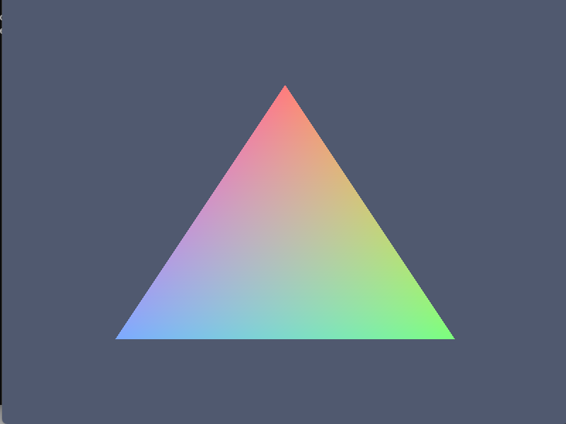

# LumaC

Lightweight cross-platform graphics API written in C11, with native Windows/Linux windowing and a Vulkan backend.

[](https://en.cppreference.com/w/c/11)
[](LICENSE)



## Overview

LumaC is a small, explicit graphics API for games and graphical
applications. It hides backend complexity (window-system integration,
device selection, swapchain negotiation, frame synchronization) behind
a handful of opaque handles — `lc_window`, `lc_device`, `lc_surface`,
`lc_swapchain`, `lc_shader`, `lc_pipeline` — while staying close to
the underlying API semantics. There is no engine, no scene graph, and
no hidden global state beyond a small explicit tracking registry used
for safe teardown ordering.

The current Vulkan backend can open a window, select a GPU, build a
swapchain, and render a vertex-indexed RGB triangle with validation
layers clean. Vertex buffers do not exist yet.

## Features

- C11 core with no C++ requirement (headers stay C++-compatible)
- Native Win32 windowing (no SDL/GLFW); X11 backend implemented
- Vulkan device foundation: instance, validation layers, deterministic
  GPU selection, per-family graphics queues
- Vulkan surfaces with present-queue discovery
- Swapchains with capability-driven format/mode/extent selection,
  per-image views, and transactional recreation
- Frame lifecycle: acquire, clear, submit, present, with two frames
  in flight and recoverable out-of-date/suboptimal handling
- SPIR-V shader modules plus a minimal graphics pipeline (empty
  layout, dynamic viewport/scissor, no culling) over a classic render
  pass; `lc_bind_pipeline` + `lc_draw` record into the open frame
- Explicit lifetime model: dependents are destroyed before the objects
  they borrow; shutdown order is pipelines, shaders, swapchains,
  surfaces, devices, windows
- Static or shared library builds; headless-safe unit tests plus
  Vulkan integration tests that skip cleanly without a GPU/display

## Current Status

Early development (`0.1.0-dev`). Triangle rendering works; there are
no vertex buffers, textures, or descriptors yet.

| Feature              | Windows          | Linux            |
| -------------------- | ---------------- | ---------------- |
| Core API             | Verified         | Verified         |
| Native windowing     | Win32 verified   | X11 implemented, runtime verified on XWayland |
| Vulkan device        | Verified (RTX 5060) | Runtime verified (lavapipe) |
| Vulkan surface       | Verified         | Runtime verified (XWayland) |
| Swapchain            | Verified         | Runtime verified (lavapipe) |
| Frame presentation   | Verified         | Runtime verified (lavapipe) |
| Triangle rendering   | Verified         | Runtime verified (lavapipe) |
| Shaders / pipeline   | Implemented      | Implemented (compiled clean) |
| Validation layers    | Clean            | Not available in test env |
| D3D12                | Planned          | N/A              |
| Wayland              | N/A              | Planned          |

Linux verification comes from WSLg/XWayland with the lavapipe software
driver; native-GPU Linux testing has not been done.

## Quick Start

```bash
cmake -S . -B build
cmake --build build --config Debug
ctest --test-dir build -C Debug --output-on-failure
```

Run the triangle example (vertex-indexed RGB triangle over a dark
background; resize, minimize, and close all behave):

```bash
# Windows:
.\build\examples\triangle\Debug\triangle.exe
# Linux:
/build/triangle/triangle
```

## Building

Requirements: CMake >= 3.15, a C11 compiler (MSVC, GCC, or Clang),
and Vulkan development files (`find_package(Vulkan REQUIRED)` —
LunarG SDK on Windows, `libvulkan-dev` on Linux). Linux also needs
X11 headers (`libx11-dev`).

### Windows

```bash
cmake -S . -B build
cmake --build build --config Debug
ctest --test-dir build -C Debug --output-on-failure
# Release:
cmake --build build --config Release
```

### Linux

```bash
sudo apt install gcc cmake libvulkan-dev libx11-dev
cmake -S . -B build -DCMAKE_BUILD_TYPE=Release
cmake --build build
ctest --test-dir build --output-on-failure
```

Options:

| Option | Default | Description |
|---|---|---|
| `LUMAC_BUILD_SHARED` | `OFF` | Build as shared library (DLL/.so) |
| `LUMAC_BUILD_EXAMPLES` | `ON` | Build examples |
| `LUMAC_BUILD_TESTS` | `ON` | Build tests |

## Example

Real frame loop using the actual current API (`examples/triangle`,
pipeline setup omitted for brevity):

```c
#include <lumac/lumac.h>

int main(void)
{
    lc_window *window;
    lc_device *device;
    lc_surface *surface;
    lc_swapchain *swapchain;
    /* ... create window, device, surface, swapchain (see example) ... */

    while (!lc_window_should_close(window)) {
        uint32_t w = lc_window_get_width(window);
        uint32_t h = lc_window_get_height(window);
        lc_result result;

        lc_poll_events();
        if (w == 0 || h == 0) {
            continue; /* minimized */
        }
        result = lc_begin_frame(swapchain);
        if (result == LC_ERROR_SWAPCHAIN_OUT_OF_DATE) {
            lc_swapchain_recreate(swapchain, w, h);
            continue;
        }
        if (result != LC_SUCCESS) {
            break;
        }
        lc_clear_color(swapchain, 0.08f, 0.10f, 0.16f, 1.0f);
        lc_bind_pipeline(swapchain, pipeline);
        lc_draw(swapchain, 3, 0);
        result = lc_end_frame(swapchain);
        if (result == LC_SUBOPTIMAL ||
            result == LC_ERROR_SWAPCHAIN_OUT_OF_DATE) {
            lc_swapchain_recreate(swapchain, w, h);
        } else if (result != LC_SUCCESS) {
            break;
        }
    }
    /* ... destroy swapchain, surface, device, window, shutdown ... */
}
```

## API Preview

- Lifecycle: `lc_init`, `lc_shutdown`, `lc_get_version_string`
- Window: `lc_window_create/destroy`, `lc_poll_events`,
  `lc_window_should_close/get_width/get_height`
- Device: `lc_device_create/destroy`,
  `lc_device_get_name/backend/vendor_id/device_id`
- Surface: `lc_surface_create/destroy/is_present_supported`
- Swapchain: `lc_swapchain_create/destroy/recreate`,
  `lc_swapchain_get_width/height/image_count`
- Frame: `lc_begin_frame`, `lc_clear_color`, `lc_end_frame`
- Shader: `lc_shader_create/destroy` (SPIR-V, vertex/fragment stages)
- Pipeline: `lc_graphics_pipeline_create`, `lc_pipeline_destroy`,
  `lc_bind_pipeline`, `lc_draw`

See `include/lumac/lumac.h` for the authoritative documented API.

## Architecture

```
Application
    |
    v
Public LumaC API  (include/lumac/lumac.h — opaque handles only)
    |
    +---- Core             (src/lumac.c)
    |
    +---- Window subsystem (src/window.c + src/platform/)
    |
    +---- Device subsystem (src/graphics/graphics.c)
    |
    +---- Surface subsystem (src/graphics/surface.c)
    |
    +---- Swapchain + frame (src/graphics/swapchain.c, frame.c)
              |
              +---- Vulkan backend (src/graphics/vulkan/)
```

A swapchain borrows its device and surface; a surface borrows its
device and window. Teardown always runs dependents-first, enforced by
internal tracking lists — no reference counting, no global singletons.

## Platform Support

- Windows 10+: Win32 windows, Vulkan via `VK_KHR_win32_surface`.
  Tested with MSVC on an NVIDIA RTX 5060, Debug and Release, static
  and shared.
- Linux: X11 windows, Vulkan via `VK_KHR_xlib_surface`. Compiles
  warning-free with GCC; runtime-verified on XWayland with lavapipe.
  Native-GPU Linux testing has not been done. Wayland is planned.

## Roadmap

- Vertex buffers, index buffers, uniform buffers
- Textures, samplers, descriptors, depth buffers
- Blend state and pipeline-state configuration API
- D3D12 backend, Wayland surface support

## Repository Structure

```
LumaC/
├── .github/workflows/   # Windows + Linux CI
├── docs/images/         # real captures (triangle.png, clear-screen.png)
├── examples/            # basic_init, window, device_info,
│                        # surface_info, swapchain_info, clear_screen,
│                        # triangle (+ shaders/)
├── include/lumac/       # public lumac.h
├── src/                 # core, platform, graphics, vulkan backend
├── tests/               # headless unit tests + Vulkan integration tests
├── CHANGELOG.md
├── CONTRIBUTING.md
├── CMakeLists.txt
├── LICENSE (MIT)
├── README.md
└── SECURITY.md
```

## Contributing

See [CONTRIBUTING.md](CONTRIBUTING.md). Bug reports and focused pull
requests are welcome; please keep scope tight and tests green.

## License

MIT — see [LICENSE](LICENSE).
