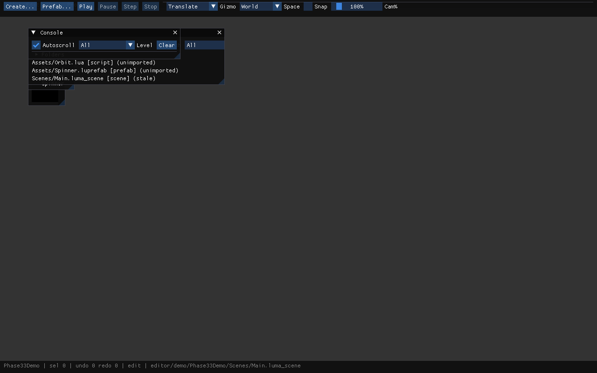

# Interactive Graphical Editor (Phase 33)

Real windowed desktop application over the headless EditorCore.
Phase 31 built the models (session/commands/reflection/play/
viewport math); Phase 32 built the project system (manifest/DB/
import/browser/prefabs); Phase 33 connects a real desktop UI to
all of it: docking panels, a rendered scene viewport, visual
TRS gizmos, reflection-driven inspector, and the Play/Stop
authoring loop.



## Layering

```
editor/app (luma_editor_app, C11 host) — window/device/swapchain/
    engine/world/session lifetimes, frame order, CLI
  |
  v
editor/src/gui (luma_editor_gui, C++11, leg_* C ABI) — context,
    input map, panels, inspector widgets, gizmo overlay,
    viewport composite, draw walk
  |
  v
editor core (led_*) — commands/history/inspect/viewport math/
    play/project/browser/prefab (UNCHANGED by Phase 33)
  |
  v
engine -> assets -> renderer -> LumaC
```

Invariants (all configure-time audited in
`editor/CMakeLists.txt`):

- GUI -> EditorCore -> engine. No back-edges; the GUI talks to
  the session ONLY through `led_*` and to the GPU ONLY through
  public `lc_*`.
- C++ is confined to `editor/src/gui/` (Immediate-mode GUI is
  C++-only). Every other layer stays C11. No C++ types cross
  the `leg_*` boundary (opaque handles + C ABI).
- `imgui.h` / `imgui_internal.h` appear ONLY in
  `editor/src/gui/*`. The app and tests never include them.
- No upstream GUI backends (`imgui_impl_*`), no Vulkan/Win32/
  X11/engine-internal/Lua spellings in GUI or app sources.
- Layout INI lives beside the process, never beside
  scenes/prefabs (no absolute paths stored in authoring data).
- Vendored Immediate-mode GUI (`third_party/imgui/`, docking
  tag `v1.92.9b-docking`): only the compiled core subset is
  extracted (4 sources + headers + LICENSE stay beside the
  pinned tarball); backends/examples/docs remain archived.

## Frame order (`editor/app/main.c`)

```
poll events -> resize/recreate -> session tick (+ play tick)
  -> lc_begin_frame -> viewport composite (engine trio, no open
  pass) -> leg_frame_begin (drain lc queue ONCE) -> panels ->
  leg_frame_end (draw data) -> swapchain pass (GUI walk) ->
  [screenshot re-record] -> lc_end_frame (present)
```

- The scene composite runs BEFORE panels so the viewport
  `Image()` samples a same-frame set (no one-frame latency,
  no stale-TexID first frame).
- The engine NEVER attaches the window (`le_engine_attach_
  window` is never called): the GUI owns the `lc_window_read_
  event` drain in `leg_frame_begin`. Play input arrives via
  `le_input_inject_*` from the app's Play contract.
- `--frames N` runs N frames (CI/screenshot discipline);
  `--screenshot out.png` re-records the same draw data into an
  offscreen RGBA8 target after the swapchain pass, then
  readbacks + writes PNG (same discipline as
  `examples/engine_scene`).
- Demo: `editor/demo/Phase33Demo/` (git-ignored generated output;
  rebuilt headless by `editor_demo_phase33` through the public
  `led_*` API: manifest + `Assets/Orbit.lua` +
  `Assets/Spinner.luprefab` + `Scenes/Main.luma_scene`) opens with
  `--project editor/demo/Phase33Demo
    --scene editor/demo/Phase33Demo/Scenes/Main.luma_scene`.

## Command rule

`GUI intent -> led_write_property / led_execute ->
Engine/Project API`. The GUI never writes component memory
directly. IDs/handles/owned strings cross the boundary only.
Value writes (`led_write_property`) are NOT history-tracked;
only `led_command` kinds push undo (TRS drags coalesce:
consecutive same-target same-kind merges).

## Proofs

- `test_editor_gui` (33, headless): NULL guards, clip matrix,
  draw budgets.
- `test_editor_gui_gpu` (52, Vulkan-gated): context, offscreen
  RGBA8 pass, panels -> nonzero stats, `leg_record_gui` walk +
  scissor restore, swapchain CLEAR present legality, gizmo
  +1X + undo, CREATE funnel + play tick + byte-identical +
  undo/redo, **1k Play/Stop stress** (byte-identical), scene
  switch (save/new/open/failed-open-preserves/revert).
- `editor_demo_phase33` (CTest): rebuilds the demo project +
  Play oracle headless.
- Headed: `luma_editor_app --frames 30 --screenshot` with the
  demo project (validation SILENT, 0 ERROR / 0 VUID).

See also: `EDITOR_VIEWPORT_RENDERING.md`,
`EDITOR_INPUT_ROUTING.md`, `EDITOR_GIZMOS.md`,
`EDITOR_WORKFLOW.md`.
