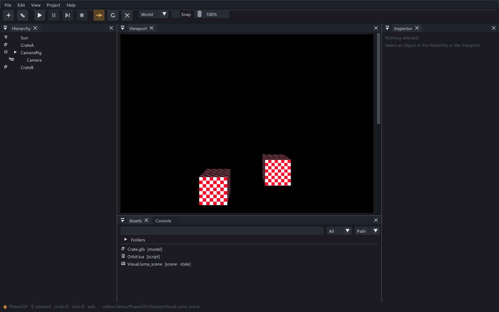

# Interactive Graphical Editor (Phase 33V)

Real windowed desktop application over the headless EditorCore.
Phase 31 built the models (session/commands/reflection/play/
viewport math); Phase 32 built the project system (manifest/DB/
import/browser/prefabs); Phase 33 connected a desktop UI to all of
it; Phase 33V independently verified, repaired, and rebuilt that
UI (theme, default layout, icons, panels, input) — see
`docs/PHASE33_VERIFICATION_AUDIT.md`,
`docs/PHASE33V_VISUAL_REVIEW.md`, `docs/EDITOR_DESIGN_SYSTEM.md`,
`docs/EDITOR_FRONTEND_DECISION.md`.



## Layering

```
editor/app (luma_editor_app, C11 host) — window/device/swapchain/
    engine/world/session lifetimes, frame order, CLI
  |
  v
editor/src/gui (luma_editor_gui, C++11, leg_* C ABI) — context,
    input map, panels, inspector widgets, gizmo overlay,
    viewport composite, draw walk
  |
  v
editor core (led_*) — commands/history/inspect/viewport math/
    play/project/browser/prefab (UNCHANGED by Phase 33)
  |
  v
engine -> assets -> renderer -> LumaC
```

Invariants (all configure-time audited in
`editor/CMakeLists.txt`):

- GUI -> EditorCore -> engine. No back-edges; the GUI talks to
  the session ONLY through `led_*` and to the GPU ONLY through
  public `lc_*`.
- C++ is confined to `editor/src/gui/` (Immediate-mode GUI is
  C++-only). Every other layer stays C11. No C++ types cross
  the `leg_*` boundary (opaque handles + C ABI).
- `imgui.h` / `imgui_internal.h` appear ONLY in
  `editor/src/gui/*`. The app and tests never include them.
- No upstream GUI backends (`imgui_impl_*`), no Vulkan/Win32/
  X11/engine-internal/Lua spellings in GUI or app sources.
- Layout INI lives beside the process, never beside
  scenes/prefabs (no absolute paths stored in authoring data).
- Vendored Immediate-mode GUI (`third_party/imgui/`, docking
  tag `v1.92.9b-docking`): only the compiled core subset is
  extracted (4 sources + headers + LICENSE stay beside the
  pinned tarball); backends/examples/docs remain archived.

## Frame order (`editor/app/main.c`)

```
poll events -> resize/recreate -> session tick (+ play tick)
  -> lc_begin_frame -> viewport composite (engine trio, no open
  pass) -> leg_frame_begin (drain lc queue ONCE) -> panels ->
  leg_frame_end (draw data) -> swapchain pass (GUI walk) ->
  [screenshot re-record] -> lc_end_frame (present)
```

- The scene composite runs BEFORE panels so the viewport
  `Image()` samples a same-frame set (no one-frame latency,
  no stale-TexID first frame).
- The engine NEVER attaches the window (`le_engine_attach_
  window` is never called): the GUI owns the `lc_window_read_
  event` drain in `leg_frame_begin`. Play input injection from
  the OS queue is a documented non-goal (see
  `EDITOR_INPUT_ROUTING.md`); Phase 33V Play = runtime tick +
  isolation with the runtime world composited to the viewport.
- `--frames N` runs N frames (CI/screenshot discipline);
  `--screenshot out.png` re-records the same draw data into an
  offscreen RGBA8 target after the swapchain pass, then
  readbacks + writes PNG (same discipline as
  `examples/engine_scene`). `--import-all` imports every
  UNIMPORTED record (same `led_import_asset` the Import button
  calls) after project open; `--select NAME` selects by name;
  `--size WxH` sizes the window (verification range);
  `--play` enters Play after setup.
- The dockspace lives in a dock-host chrome window below the
  menu/toolbar (`ImGui::DockSpace(LEG_DOCK_ROOT)`); the default
  arrangement (Hierarchy | Viewport + Assets/Console | Inspector)
  is built once per context by the DockBuilder layout TU
  (`editor/src/gui/gui_layout.cpp` — the single
  `imgui_internal.h` exception, DockBuilder* only) and rebuilt
  on View -> Reset layout. Layout INI is in-memory by default
  (deterministic every launch); `leg_set_ini_path` honors a host
  path when set (dead plumbing fixed in 33V).
- Visual demo: `editor/demo/Phase33V/` (committed fixture: crate
  model dropped twice through the real drop path + camera rig +
  sun + orbit script, `Scenes/Visual.luma_scene`) opens with
  `--project editor/demo/Phase33V --scene
  editor/demo/Phase33V/Scenes/Visual.luma_scene --import-all`.
  The older `editor/demo/Phase33Demo/` fixture builder
  (`editor_demo_phase33`) is unchanged.

## Command rule

`GUI intent -> led_write_property / led_execute ->
Engine/Project API`. The GUI never writes component memory
directly. IDs/handles/owned strings cross the boundary only.
Value writes (`led_write_property`) are NOT history-tracked;
only `led_command` kinds push undo (TRS drags coalesce:
consecutive same-target same-kind merges).

## Proofs

- `test_editor_gui` (33, headless): NULL guards, clip matrix,
  draw budgets (the old "input ownership" header claim removed —
  positive input mapping lives in the GPU suite since 33V).
- `test_editor_gui_gpu` (61, Vulkan-gated): context, offscreen
  RGBA8 pass, panels -> nonzero stats, positive `leg_feed_event`
  mapping matrix (9, new in 33V), `leg_record_gui` walk +
  scissor restore, swapchain CLEAR present legality, gizmo
  +1X + undo, CREATE funnel + play tick + byte-identical +
  undo/redo, **1k Play/Stop stress** (byte-identical), scene
  switch (save/new/open/failed-open-preserves/revert).
- `test_editor_negative` (43, new in 33V, headless): bad
  project/scene paths, reparent cycle + self-parent rejection,
  stale-handle ops, missing prefab, play/save guards, empty drop
  payloads — all fail cleanly with state preserved.
- `editor_demo_phase33` (CTest fixture): rebuilds the Phase33Demo
  project headless (rated NOT ACTUALLY TESTING CLAIM as a test;
  kept as a fixture generator).
- Headed (Phase 33V): `luma_editor_app` opens the Phase33V
  fixture (`--import-all`), renders crates to the viewport,
  plays with runtime isolation, mirrors script errors to the
  console; evidence in `docs/verification/phase33v/` with the
  per-shot review in `docs/PHASE33V_VISUAL_REVIEW.md`. Validation
  layers silent (0 ERROR / 0 VUID) on headed runs.

See also: `EDITOR_VIEWPORT_RENDERING.md`,
`EDITOR_INPUT_ROUTING.md`, `EDITOR_GIZMOS.md`,
`EDITOR_WORKFLOW.md`.
